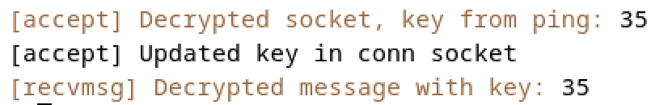

# Encrypted Socket

## Summary

Encrypted socket implemented in the Linux kernel.

## Environment

### Tested on

* Mac mini with an M1 Apple silicone 
* Linux VM running on UTM:
  * Distribution: `Debian 12.2.0-14` from [UTM gallery](https://mac.getutm.app/gallery/debian-12)
  * Kernel version (`uname -r`): `6.1.0-13-arm64`

## Setup

* This projects involves adding new features to the linux kernel
* As this is a complicated process, it's described in a dedicated page: [Recompile Kernel](recompile.md)
* This page starts with `summary` section - a brief description of:
  * The recompilation steps
  * The development process
  * Useful scripts
* __Don't skip the `summary` section__
  * it includes a lot of useful tips, that will save a lot of time (and pain)
* The page includes a POC example:
  * Allows to check that the compilation runs properly with a small modification
  * If possible, run the POC first and check it's working before doing more heavy modifications

## Intended Usage

### Concept

* Assumes 2 machines, both with modified kernel
* The main idea behind this implementation, is to keep it hidden from the user
* The only thing changed here, is the addition of a flag to the socket initialization
  * __Client:__ Initializes a socket, with the secret `ENCRYPT` flag
      ```c
      int fd = socket(AF_INET, SOCK_STREAM | (1 << SOCK_ENCRYPT), 0);
      ```
  * __Server:__ Initializes a socket, with the secret `DECRYPT` flag
      ```c
      int fd = socket(AF_INET, SOCK_STREAM | (1 << SOCK_DECRYPT), 0);
      ```
### POC Scripts

* To demonstrate the simplicity of this method, minimal scripts for client and server are provided
* One can notice that this scripts looks like any other basic server/client script in `c`!
* As mentioned in the concept, the only thing special here is flags in initialization
* Both script defines the `IP` and `PORT` hardcoded as `define` at the top, __modify before compiling!__
* __Client:__
  * Uses the `ENCRYPT` socket, sending a message encrypted
  * Path: [`/socket_scripts/client.c`](/socket_scripts/client.c)
  * Compile: `gcc /socket_scripts/client.c -o client`
  * Run: `sh ./client`
* __Server:__
  * Uses the `DECRYPT` socket, receiving a message decrypted
  * Path: [`/socket_scripts/server.c`](/socket_scripts/server.c)
  * Compile: `gcc /socket_scripts/server.c -o server`
  * Run: `sh ./server`

### Example (POC Scripts)

* Initialized a vm with the modified kernel, following the instructions above
* Cloned the vm, and changed the mac address of the cloned machine (to get a new `IP` address)
* defined second machine as server (receiving) and found its IP with:
  ```bash
  ip -4 addr show scope global | grep inet | awk '{print $2}'
  ```
* Followed this steps (in this order):
  * Copied the client/server scripts for each machine and compiled it (after updating `IP` in both scripts)
  * __Server:__ 
    * Started the server `sh ./server`
    * The server in listening mode, waiting for connection
  * __Client:__
    * Launched `tcpdump` to sniff the message:
      ```bash
      sudo tcpdump -A -X tcp and dst 192.168.64.14 and "tcp[tcpflags] & tcp-ack == 0"
      ```
    * Started the client `sh ./client`
    * Checked the kernel logs with `sudo dmesg`
* __Result:__
  * __Client:__
    * The client script sent `Hello from client`:
      
    * The message was encrypted by the kernel, with key `35` (`dmesg`):
      
    * The message cought by `tcpdump` is clearly encryped:
      
  * __Server:__
    * The server reconstructed the message:
      
    * The message was decrypted by the kernel (`dmesg`):
      
  
